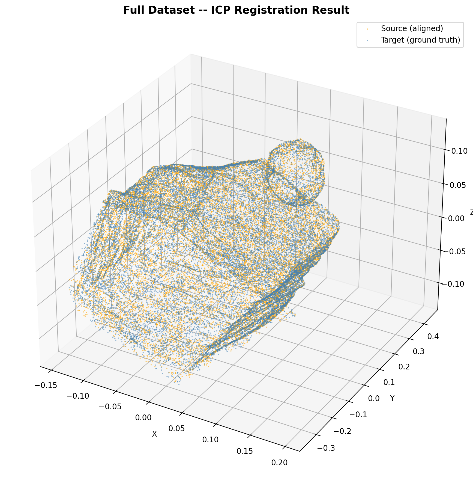
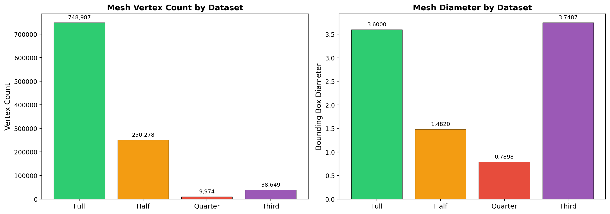

# 3D Mesh Processing and Surface Reconstruction



## Overview

This project implements a complete 3D mesh processing and surface reconstruction pipeline. It evaluates the impact of partial image datasets on 3D geometry reconstruction quality by comparing estimated camera poses and resulting structural meshes against a high-density ground truth model. The core pipeline leverages Structure from Motion (SfM) principles, point cloud sampling analysis, and Iterative Closest Point (ICP) registration.

A quantitative analysis pipeline evaluating 3D surface reconstruction quality and ICP registration accuracy under degraded Structure-from-Motion (SfM) image overlap constraints.

## Pipeline

The project is structured into a five-step quantitative evaluation pipeline:

1. **Mesh Loading & Preprocessing**: Efficiently loading STL geometries and uniformly sampling point clouds to manage computational complexity while preserving surface detail.
2. **Visualization**: Plotting 3D structures and overlaying registered geometries for qualitative inspection.
3. **Sampling / Partial Dataset Analysis**: Evaluating mesh degradation (vertex count, spatial extent) when reconstructed from reduced image sets (Full, Half, Quarter, Third).
4. **Registration Engine (RANSAC + ICP)**: Aligning reconstructed meshes to the ground truth coordinate space using Fast Point Feature Histograms (FPFH) for global initialization, followed by point-to-plane ICP refinement.
5. **Metric Evaluation**: Quantifying alignment quality using overlapping Fitness scores and Inlier RMSE metrics.

## Experimental Results

The experimental evaluation tested the pipeline on four reconstruction variants of the same physical structure.

### ICP Registration Quality

| Dataset | Fitness Score | Inlier RMSE |
| :--- | :--- | :--- |
| **Full** | 0.9943 | 0.0030 |
| **Half** | 0.7361 | 0.0036 |
| **Quarter**| 0.5633 | 0.0046 |
| **Third** | 0.4904 | 0.0047 |

*Note: The Full dataset achieves near-perfect alignment. The drastic drop in fitness for reduced datasets indicates catastrophic structural loss (holes in the computed mesh), despite the remaining fragments aligning closely (consistent RMSE).*




## Technical Insights

* **Impact of Partial Geometry**: Reducing the number of images during the SfM phase breaks critical feature tracks and loop closures. This leads to massive chunks of missing geometry rather than uniform degradation, as evidenced by the sharp drop in the Fitness score.
* **Sampling Resolution Effects**: Uniform surface sampling is critical prior to ICP. Utilizing raw mesh vertices directly biases the registration toward high-density regions (areas of high detail), whereas uniform sampling guarantees the entire surface contributes equally to the cost function.
* **Reconstruction Limitations**: Monocular SfM suffers from inherent scale ambiguity. A critical preprocessing step requires calculating spatial diameters and dynamically normalizing the reconstructed mesh scales before attempting global feature matching.
* **Computational Considerations**: Calculating exact nearest-neighbors on dense point clouds is an $O(N^2)$ operation. Leveraging voxel downsampling and FPFH descriptors drops the global initialization phase from minutes to milliseconds, allowing real-time refinement.

## How to Run

### Installation

Ensure you have a modern Python 3.x environment. Install the pipeline dependencies:

```bash
pip install -r requirements.txt
```

### Generating Result Visualizations

Due to the heavy graphical requirements of 3D point cloud rendering, result images are generated via execution of the primary processing script.

1. Ensure all dataset STL files are present in the `data/` directory.
2. Run the main processing pipeline:

```bash
python -m src.main --save-plots
```

The script will output all metrics to the console, save numerical results to `results/numerical_results.txt`, and generate the following plots in the `report/result_images/` directory:
* `full_mesh.png`
* `partial_mesh.png`
* `sampling_comparison.png`
* `reconstruction_result.png`
* `metric_analysis.png`

Alternatively, you can explore the processing steps interactively via the Jupyter notebook:
```bash
jupyter notebook notebooks/mesh_analysis_notebook.ipynb
```

## Applications

The techniques demonstrated in this project form the mathematical backbone for numerous advanced robotics and computer vision applications:
* **3D Scanning**: Quality assurance for industrial part digitization.
* **Robotics Perception**: Spatial understanding for autonomous manipulation.
* **Surface Reconstruction**: Generating manifold geometries from sparse LiDAR or RGB-D sensors.
* **SLAM Mapping**: Loop closure verification and map optimization in unknown environments.
* **Digital Twin Modeling**: Creating accurate virtual representations of physical architecture.
