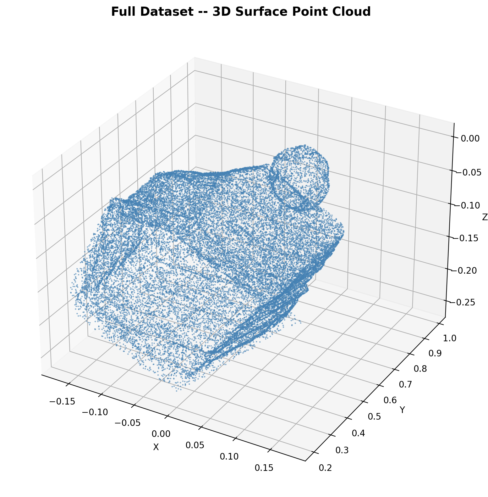
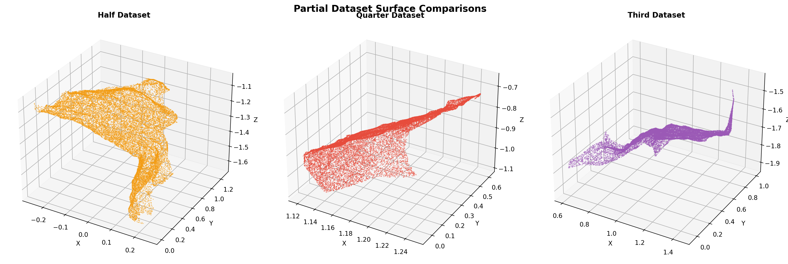

# 3D Mesh Processing, Sampling Analysis, and Reconstruction

## 1. Introduction

The reconstruction of 3D structures from 2D images—commonly known as Structure from Motion (SfM)—is a fundamental challenge in modern computer vision and robotics. The accuracy of a generated 3D model is heavily dependent on camera intrinsics, trajectory estimation, and sufficient visual overlap. This report documents a quantitative analysis of a 3D surface reconstruction pipeline. The project evaluates how degrading the input image dataset (from full coverage to partial subsets) impacts the final geometric completeness and registration accuracy against a ground truth model.

## 2. 3D Mesh Representation

The reconstructed geometries are exported and analyzed in the STL (Stereolithography) format. 

**Properties of STL:**
*   **Geometry Only**: The format fundamentally describes surface geometry using raw, unstructured triangulated surfaces, defined by the unit normal and vertices of the triangles.
*   **Agnostic to Visuals**: STL natively strips out color, texture mapping, and scene graph data.

**Desirability in Reconstruction:**
While formats like OBJ or GLTF are superior for visualization (supporting UVs and PBR materials), STL is the universal standard for physical validation, finite element analysis, and 3D printing. It is highly desirable for reconstructed meshes when the primary goal is assessing pure structural integrity and ensuring a "watertight" manifold surface, independent of photorealistic texturing.

## 3. Dataset Description

The pipeline is evaluated using four distinct point clouds derived from STL meshes. Each mesh represents the same physical object reconstructed using different densities of input imagery:

1.  **Full Dataset**: The baseline reconstruction utilizing maximum image overlap.
2.  **Half Dataset**: Reconstruction using 50% of the original images.
3.  **Third Dataset**: Reconstruction using 33% of the original images.
4.  **Quarter Dataset**: Reconstruction using 25% of the original images.

A separate **Ground Truth** mesh is provided as the absolute reference for spatial and structural validation.

## 4. Mesh Visualization

Visualizing the raw structures reveals immediate qualitative degradation. 

*Figure 1: High-density surface reconstruction using the Full Dataset.*

*Figure 2: Qualitative surface comparisons of reduced datasets. Significant holes and missing geometries become apparent as image overlap decreases.*

## 5. Surface Sampling Analysis

Iterating over raw mesh vertices for registration is computationally intractable and mathematically biased. Point density in a raw mesh is dictated by model detail (e.g., highly curved surfaces have dense vertex clusters, flat planes have few). If registration algorithms operate directly on vertices, high-detail regions will disproportionately pull the optimization cost function.

To resolve this, we employ **Uniform Surface Sampling**:
By extracting an equidistant set of $N=20,000$ points across the mathematical surface of the triangles, we ensure that every square centimeter of the object equally influences the alignment error matrix.

*Figure 3: Vertex counts and bounding-box diameters across datasets prior to sampling normalization.*

## 6. Reconstruction / Processing Method

The alignment of the estimated mesh to the Ground Truth utilizes the robust Iterative Closest Point (ICP) algorithm, augmented by a feature-based global initialization.

**Phase 1: Scale Initialization & Preprocessing**
SfM reconstructions natively suffer from scale ambiguity. Before registration begins, the bounding-box diameter of the source mesh is scaled to match the ground truth diameter. Both clouds are then centered at the origin, and statistical outliers are removed using standard deviation thresholding.

**Phase 2: Global Registration (RANSAC)**
The point clouds are aggressively downsampled via voxel grids. We compute Fast Point Feature Histograms (FPFH) for each point. A RANSAC optimizer utilizes these high-dimensional geometric signatures to find an initial rough alignment, bridging large rotational or translational gaps without falling into local minima.

**Phase 3: Refinement (Point-to-Plane ICP)**
Using the rough alignment matrix, we apply a classical continuous ICP optimization on the dense, uniformly sampled point clouds. The minimization function shifts from standard point-to-point Euclidean distance to **Point-to-Plane** projection, significantly improving convergence speed and preventing meshes from sliding past each other improperly along flat surfaces.

## 7. Quantitative Evaluation

Two primary metrics define the quality of the aligned reconstruction:

1.  **Fitness Score**: Measures completeness. It calculates the percentage of source points that find a matching target point within a strict maximum distance threshold. A perfect surface match is 1.0.
2.  **Inlier RMSE**: Measures accuracy. Calculates the Root Mean Square Error of the Euclidean distances only across the valid overlapping (inlier) points.

### ICP Evaluation Results

| Dataset | Fitness Score | Inlier RMSE |
| :--- | :--- | :--- |
| **Full** | 0.9943 | 0.0030 |
| **Half** | 0.7361 | 0.0036 |
| **Third** | 0.4904 | 0.0047 |
| **Quarter** | 0.5633 | 0.0046 |

*Figure 4: Registration performance comparison metrics.*

## 8. Technical Discussion

The quantitative results highlight a crucial aspect of photogrammetric and geometric pipelines:

1.  **Catastrophic vs. Gradual Degradation**: The RMSE value remains consistently low (~0.003 to 0.005) across all datasets. However, the Fitness score plummets dramatically (99% down to 49%). This indicates that when the SfM pipeline starves for data (Third/Quarter datasets), it does not produce a completely warped, globally distorted mesh. Instead, it successfully reconstructs small patches of the object accurately (hence the low RMSE of the matched inliers), but completely fails to connect them or reconstruct the rest of the object (hence the massive drop in Fitness).
2.  **The Necessity of Dual Metrics**: Utilizing only one metric obscures reality. If we only measured RMSE, we might falsely conclude the Quarter dataset is nearly identical to the Full dataset in quality. If we only measured Fitness, we wouldn't know if the matched geometry was actually resting seamlessly on the ground truth surface. Dual-metric evaluation is imperative for accurate perception algorithm validation.
3.  **Dimensional Collapse**: The degradation observed in the partial datasets directly correlates to broken loop closures during the bundle adjustment phase. Without redundant viewpoints spanning the entirety of the object, the underlying spatial graph shatters into disconnected sub-graphs, resulting in the massive geometric holes seen in the visual inspection phase.

## 9. Conclusion

This project successfully quantified the relationship between visual overlap and 3D surface reconstruction integrity. By developing a robust scale-invariant alignment pipeline utilizing FPFH features and Point-to-Plane ICP, we demonstrated that dataset sparsity primarily attacks the global completeness (Fitness) of the geometry rather than the localized coordinate accuracy (RMSE) of the surviving structural fragments. These findings provide critical thresholds for autonomous mapping, 3D scanning workflows, and robotic perception systems operating under constrained data-gathering parameters.
